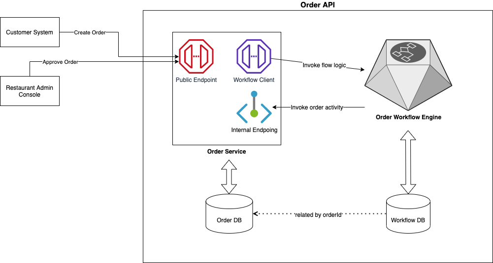

# pizza-order-workflow-demo
This project demostrates the integration between a microservice and different workflow engines (currently only temporal.io) 

## Biz Requirements

Implement the pizza order process from [camunda doc](https://camunda.com/blog/2015/06/build-your-own-camunda-task-explorer/):

## System Architecture

### Order service is the facade

External services will invoke the `Order Service` using parameters like `orderId`. They know nothing about the workflow engine.

### Order workflow engine focuses on `flow` 

The workflow engine knows little about order's biz logic. 
* It just invokes the logic in `Order Service`, as it is an orchestrator
* It won't store order data by itself

## Try it

### Prerequisites 

* Docker
* docker-composer
* JDK 11+

### Start the services

* Start workflow engine
    * If temporal-io is used, [start its services](temporal-io-workflow/start-services.md)
* [Start order-service](order-service/start-services.md)

### Execute workflows

See [Workflow Execution Showcase](doc/workflow-execution-showcase.md)

## How things work

Understand the details by reading code. There is some guidance below.

### Order Service Code

### Workflow engine artefacts

#### if temporal.io is used

